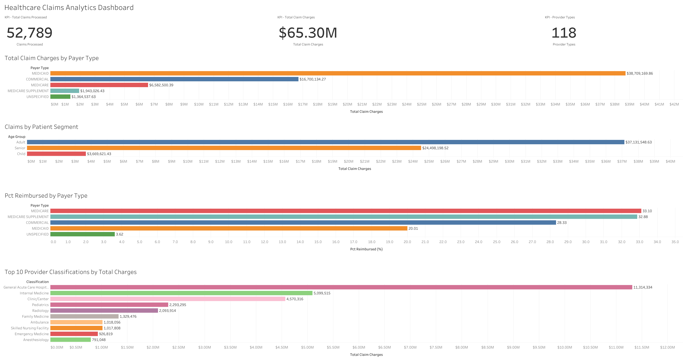
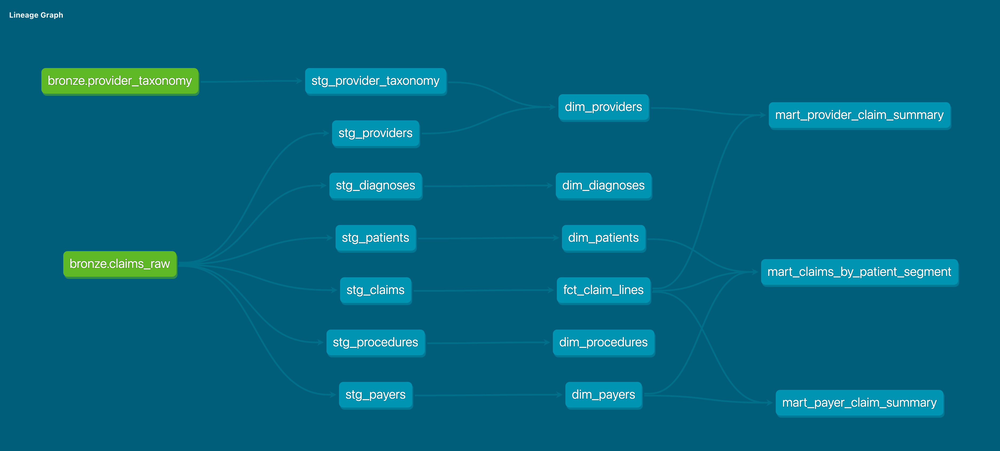

# Healthcare Claims Analytics

End-to-end analytics engineering project that leverages Databricks, Unity Catalog, PySpark, dbt, SQL, and Tableau to build a modern Medallion Architecture (Bronze, Silver, Gold) for healthcare claims analytics.

## Project Overview

This project analyzes healthcare claims data to uncover insights related to: 

- Claim charges by payer type
- Patient segment spending patterns
- Reimbursement rates across insurance programs
- Provider classification performance

The project follows a modern Medallion Architecture (Bronze, Silver Gold) using Databricks and dbt.

## Tech Stack

- Databricks
- dbt
- PySpark
- SQL
- Unity Catalog
- Tableau
- Jupyter/Databricks Notebooks
- Git & GitHub

## Repository Structure

models/
├── stg
├── dim
├── fct
└── mart

notebooks/
├── 01_create_catalog_schemas_bronze.ipynb
└── 02_data_profiling_and_validation.ipynb

screenshots/
seeds/
tests/

## Architecture

### Project Workflow
1. Create Unity Catalog and Bronze layer
2. Profile and validate raw healthcare claims
3. Transform and standardize raw data using dbt staging models
4. Build dimension tables
5. Build fact tables
6. Build business marts
7. Visualize results in Tableau

Exploratory data profiling and validation were completed in Databricks notebooks before implementing production-ready dbt models.

### Bronze Layer

Raw healthcare claims data ingested into Databricks.

### Silver Layer

Standardized staging models created with dbt.

Examples:

- stg_patients
- stg_claims
- stg_providers
- stg_payers
- stg_diagnoses

### Gold Layer

Analytics-ready dimensional model consisting of:

Dimensions:
- dim_patients
- dim_providers
- dim_payers
- dim_diagnoses

Fact Table:
- fct_claim_lines

Business Marts:
- mart_claims_by_patient_segment
- mart_payer_claim_summary
- mart_provider_claim_summary

## Data Validation

Before building the analytics models, exploratory profiling and validation were performed to:

- Validate the Bronze layer load
- Assess null values in key business fields
- Verify patient demographic consistency
- Profile payer distribution and diagnosis frequency
- Confirm dimension table record counts
- Validate provider taxonomy reference data

Implemented automated dbt data quality tests including:

- unique
- not_null
- relationships
- accepted_values

## Tableau Dashboard

Interactive Dashboard built in Tableau Public.

Dashboard highlights:

- Total healthcare claim charges
- Claims by patient age segment
- Reimbursement percentage by payer type
- Top provider classifications by total charges

View Dashboard: 

[Tableau Dashboard] https://public.tableau.com/app/profile/azure.augustus/viz/HealthcareClaimsAnalyticsDashboard_17821694323430/Dashboard1?publish=yes

## Key Findings

- Adult patients generated the highest total claim charges.
- Medicaid represented the largest payer cateogry by total charges.
- Reimbursement percentages varied significantly across payer types.
- General Acute Care Hospitals generated the highest provider charges.

## Repository includes:

- dbt lineage graph
- Tableau dashboard
- Databricks notebooks documenting data ingestion and exploratory data profiling

## Dashboard Preview

## dbt Lineage

